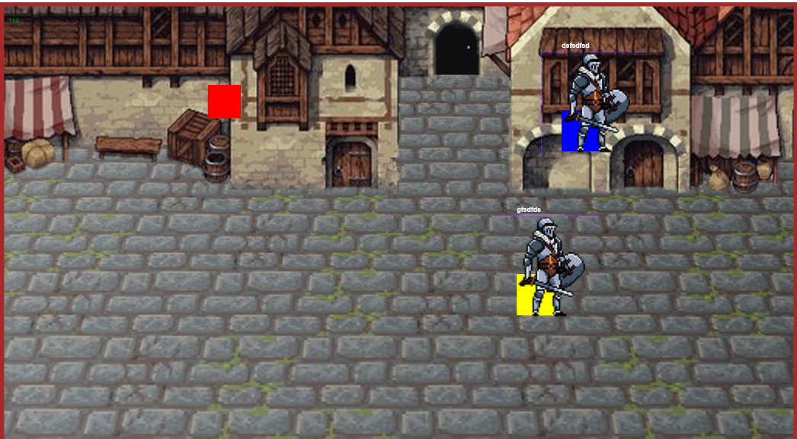

# Баг-репорт: Персонаж проходит через текстуры

## ID дефекта  
BG-1

## Приоритет  
High

## Шаги для воспроизведения  
1. Запустить игру.  
2. Управляя персонажем (WASD), подойти к любой стене или непроходимому объекту.  
3. Продолжать движение (удерживать клавишу) в направлении текстуры.  
4. Наблюдать за поведением коллизии.

## Ожидаемый результат  
Персонаж должен останавливаться перед непроходимой текстурой, не проходя сквозь неё.

## Фактический результат  
Персонаж проходит сквозь текстуры, попадая за пределы игровой области или внутрь объектов.

## Вложения  

