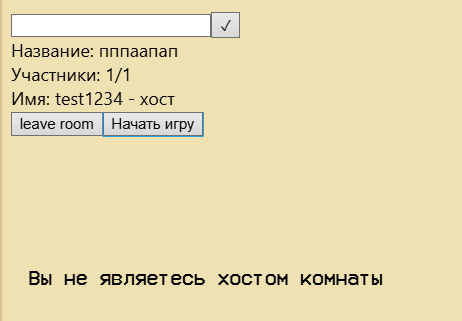

# Баг-репорт: окно комнаты не пропадает при выходе из комнаты

## ID дефекта
ROOM-001

## Приоритет
Medium

## Шаги для воспроизведения
1. Войти в комнату
2. Нажать кнопку "Выйти из комнаты"
3. Проверить, исчезло ли окно комнаты

## Ожидаемый результат
Окно комнаты полностью закрывается при выходе из комнаты

## Фактический результат
Окно комнаты остается на экране после выхода из комнаты

## Вложения
